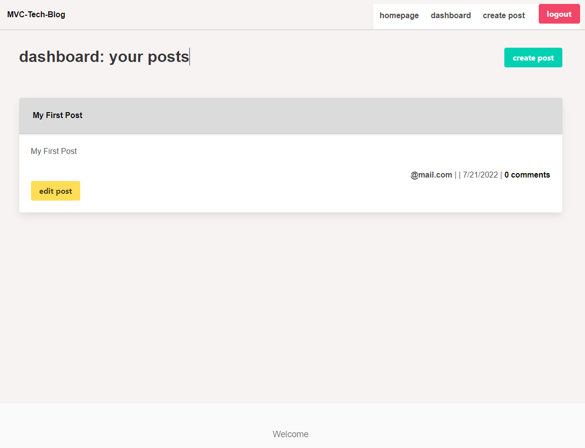

# MVC Tech Blog
   
## Description

This is a blog using MySQL2, Express, Sequelize, Handlebars, and a mysql database for the purpose of hosting posts and comments made by users. 

## Deployment

Visit the Herokuapp.com deployment here: [Link](https://mvc-tech-blog-139.herokuapp.com/)

## Screenshot

  
## License

MIT